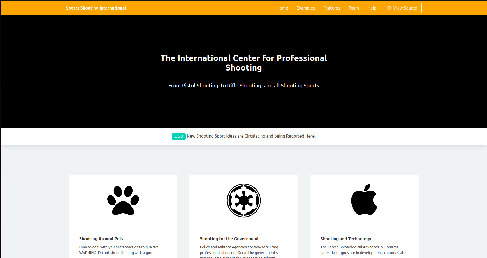
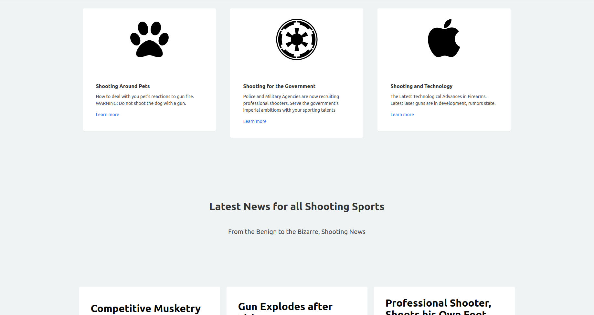

# Screenshots:

## Installation Instructions:
Fork and Clone this repository and type "npm install" in the terminal to obtain necessary dependencies.

## Component and Data Snippet:
One Component and its Data Code Snippet, Shooting.js (Front Page)
~~~js
import React, { Component } from 'react';
import './Shooting.css';

// Component
import { Article } from './Article'

const newShootingNews = [{
    title1: 'Competitive Musketry',
    content1: 'New Olympic Sport Proposal involving Smoothbore Muskets, Requires Minimal Training',

    title2: 'Gun Explodes after Firing',
    content2: 'Contestant Replaces Gunpowder with High Explosives',

    title3: 'Professional Shooter, Shoots his Own Foot',
    subtitle3: 'Strange Occurances',
    content3: 'Rumor of Avoiding Shooting Practice',

    title4: 'Ammunition Cost Rising',
    content4: 'Rising to New Heights',

    title5: 'Ammunition Cost Still Rising',
    content5: 'Still Rising to Even Higher Heights',

    title6: 'Great Places to Shoot',
    content6: 'Somewhere Near this Image',

    title7: 'Revolutionary New Shooting Sport, Skeet Lobbing',
    subtitle7: 'Odd Idea to increase Olympic Viewership',
    content7: 'Contestants will throw Skeets at the Guns this time',

    title8: 'Fewer People Watching Olympic Shooting Events',
    subtitle8: 'Olympic Committee Perplexed',
    content8: 'Management Suggests Utilizing Machine Guns to Attract more Viewers',

    title9: 'Jam Shooting',
    subtitle9: 'A New Shooting Sport',
    content9: 'Guns are covered in mud, last one to jam wins',

    title10: 'Gun Juggling',
    subtitle10: 'Contestant Wins Gold Medal in Juggling Guns',
    content10: 'Latest Sport Baffles Audience',

    title11: 'Bayonet Fighting',
    subtitle11: 'New Shooting Sport without Shooting',
    content11: 'Contestants Attempt to Stab each other with Bayonets instead',

    title12: 'Sports Shooting',
    subtitle12: 'This time it is Different',
    content12: 'New Sport where people Shoot the Equipment of other Sports with Guns',
}];

const displayShootingNewsList = newShootingNews.map((post, idx) => {
    return (
        <Article key={idx} index={idx}

            title1={post.title1}
            content1={post.content1}

            title2={post.title2}
            content2={post.content2}

            title3={post.title3}
            subtitle3={post.subtitle3}
            content3={post.content3}

            title4={post.title4}
            content4={post.content4}

            title5={post.title5}
            content5={post.content5}

            title6={post.title6}
            content6={post.content6}

            title7={post.title7}
            subtitle7={post.subtitle7}
            content7={post.content7}

            title8={post.title8}
            subtitle8={post.subtitle8}
            content8={post.content8}

            title9={post.title9}
            subtitle9={post.subtitle9}
            content9={post.content9}

            title10={post.title10}
            subtitle10={post.subtitle10}
            content10={post.content10}

            title11={post.title11}
            subtitle11={post.subtitle11}
            content11={post.content11}

            title12={post.title12}
            subtitle12={post.subtitle12}
            content12={post.content12}

        />
    );
});

class Shooting extends Component {
    render() {
        return (
            

                <section className="hero is-info is-medium is-bold">
                    

                        <nav className="navbar">
                            

                                

                                    <a className="navbar-item" href="../">
                                        <h1><strong>Sports Shooting International</strong></h1>
                                        {/*  */}
                                    </a>
                                    
                                        
                                        
                                        
                                    
                                

                                

                                    

                                        

                                            <ul>
                                                <li className="is-active"><a>Home</a></li>
                                                <li><a href="">Examples</a></li>
                                                <li><a href="">Features</a></li>
                                                <li><a href="">Team</a></li>
                                                <li><a href="">Help</a></li>
                                            </ul>
                                            
                                                <a className="button is-white is-outlined" href="https://github.com/BulmaTemplates/bulma-templates/blob/master/templates/hero.html">
                                                    
                                                        <i className="fa fa-github"></i>
                                                    
                                                    View Source
                                                </a>
                                            
                                        

                                    

                                

                            

                        </nav>
                    

                    

                        

                            <h1 className="title">
                                The International Center for Professional Shooting
                            </h1>
                            <h2 className="subtitle">
                                From Pistol Shooting, to Rifle Shooting, and all Shooting Sports
                            </h2>
                        

                    

                </section>
                

                    

                        Latest New Shooting Sport Ideas are Circulating and being Reported Here.
                    

                

                <section className="container">
                    

                        

                            

                                

                                    <i className="fa fa-paw"></i>
                                

                                

                                    

                                        <h4>Shooting Around Pets</h4>
                                        
How to deal with you pet's reactions to gun fire. WARNING: Do not shoot the dog with a gun.

                                        
<a href="#">Learn more</a>

                                    

                                

                            

                        

                        

                            

                                

                                    <i className="fa fa-empire"></i>
                                

                                

                                    

                                        <h4>Shooting for the Government</h4>
                                        
Police and Military Agencies are now recruiting professional shooters. Serve the government's imperial ambitions with your sporting talents

                                        
<a href="#">Learn more</a>

                                    

                                

                            

                        

                        

                            

                                

                                    <i className="fa fa-apple"></i>
                                

                                

                                    

                                        <h4>Shooting and Technology</h4>
                                        
The Latest Technological Advances in Firearms. Latest laser guns are in development, rumors state.

                                        
<a href="#">Learn more</a>

                                    

                                

                            

                        

                    

                    

                        <h2 className="title">Latest News for all Shooting Sports</h2> 
                        
From the Benign to the Bizarre, Shooting News

                    

                    {displayShootingNewsList}
                </section>
                <footer className="footer">
                    

                        

                            

                                <h2><strong>Pistol Shooting Livestream</strong></h2>
                                <ul>
                                    <li><a href="#">Competition #1</a></li>
                                    <li><a href="#">Competition #2</a></li>
                                    <li><a href="#">Competition #3</a></li>
                                    <li><a href="#">Competition #4</a></li>
                                    <li><a href="#">Competition #5</a></li>
                                    <li><a href="#">Competition #6</a></li>
                                    <li><a href="#">Competition #7</a></li>
                                </ul>
                            

                            

                                <h2><strong>Rifle Shooting Livestream</strong></h2>
                                <ul>
                                    <li><a href="#">Competition #1</a></li>
                                    <li><a href="#">Competition #2</a></li>
                                    <li><a href="#">Competition #3</a></li>
                                    <li><a href="#">Competition #4</a></li>
                                    <li><a href="#">Competition #5</a></li>
                                    <li><a href="#">Competition #6</a></li>
                                    <li><a href="#">Competition #7</a></li>
                                </ul>
                            

                            

                                <h2><strong>Shotgun Shooting Livestream</strong></h2>
                                <ul>
                                    <li><a href="#">Competition #1</a></li>
                                    <li><a href="#">Competition #2</a></li>
                                    <li><a href="#">Competition #3</a></li>
                                    <li><a href="#">Competition #4</a></li>
                                    <li><a href="#">Competition #5</a></li>
                                    <li><a href="#">Competition #6</a></li>
                                    <li><a href="#">Competition #7</a></li>
                                </ul>
                            

                        

                    

                    
                </footer>
            

        );
    }
}

export default Shooting;
~~~

## Test Snippet:
Code Snippet of Test for Shooting.js
~~~js
import { render, screen } from '@testing-library/react';
import Shooting from './Shooting';

test('renders Text tag', () => {
    render(<Shooting />);
    const pElement = screen.getByText(/Competitive Musketry/i);
    expect(pElement).toBeInTheDocument();
});

test('renders Text tag', () => {
    render(<Shooting />);
    const pElement = screen.getByText(/Gun Explodes after Firing/i);
    expect(pElement).toBeInTheDocument();
});

test('renders Text tag', () => {
    render(<Shooting />);
    const pElement = screen.getByText(/Professional Shooter, Shoots his Own Foot/i);
    expect(pElement).toBeInTheDocument();
});

test('renders Text tag', () => {
    render(<Shooting />);
    const pElement = screen.getByText(/Ammunition Cost Rising/i);
    expect(pElement).toBeInTheDocument();
});

test('renders Text tag', () => {
    render(<Shooting />);
    const pElement = screen.getByText(/Ammunition Cost Still Rising/i);
    expect(pElement).toBeInTheDocument();
});

test('renders Text tag', () => {
    render(<Shooting />);
    const pElement = screen.getByText(/Great Places to Shoot/i);
    expect(pElement).toBeInTheDocument();
});

test('renders Text tag', () => {
    render(<Shooting />);
    const pElement = screen.getByText(/Revolutionary New Shooting Sport, Skeet Lobbing/i);
    expect(pElement).toBeInTheDocument();
});

test('renders Text tag', () => {
    render(<Shooting />);
    const pElement = screen.getByText(/Fewer People Watching Olympic Shooting Events/i);
    expect(pElement).toBeInTheDocument();
});

test('renders Text tag', () => {
    render(<Shooting />);
    const pElement = screen.getByText(/Jam Shooting/i);
    expect(pElement).toBeInTheDocument();
});

test('renders Text tag', () => {
    render(<Shooting />);
    const pElement = screen.getByText(/Gun Juggling/i);
    expect(pElement).toBeInTheDocument();
});

test('renders Text tag', () => {
    render(<Shooting />);
    const pElement = screen.getByText(/Bayonet Fighting/i);
    expect(pElement).toBeInTheDocument();
});

test('renders Text tag', () => {
    render(<Shooting />);
    const pElement = screen.getByText(/This time it is Different/i);
    expect(pElement).toBeInTheDocument();
});

~~~

Heroku Link: https://shooting-sport.herokuapp.com/